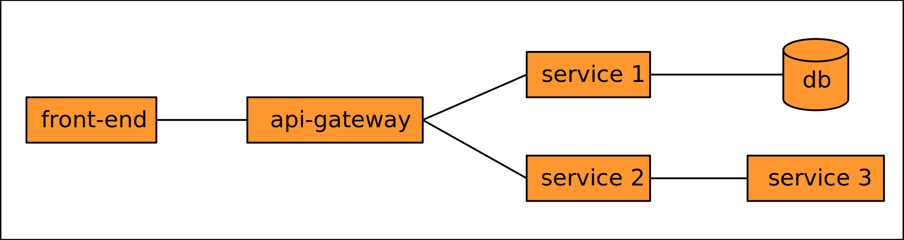
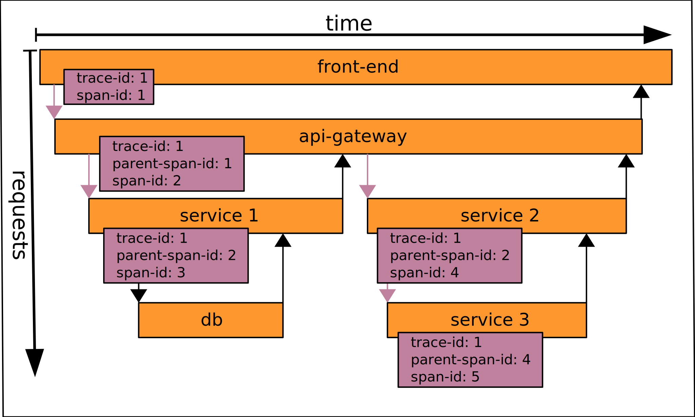

I'm currently reading the book [Distributed Tracing in Practice](https://www.oreilly.com/library/view/distributed-tracing-in/9781492056621/) and really like it. The book provides an example that you can find on the github repository [distributed-tracing-in-practice/microcalc](https://github.com/distributed-tracing-in-practice/microcalc). 

After reviewing this example, I saw some room for improvement. First of all, I think the example would be easier to use if it would use just one programming language. Their example currently uses JavaScript for the front-end and Go for the back-end. And I would prefer to be able to start the whole example with just one command and without the need to install multiple other programs. And it would be nice if changing the source code would immediately reload my code. 

And that's why I decided to create my own example which is based on their example. It's written in JavaScript, uses node for the back-end and docker-compose to run all services together with the UI. And to present this example, let's start with some introduction to the topic.

# What is distributed tracing?

Distributed tracing allows tracing of the actual calls between components of a distributed system. The example below shows a typical distributed system, which consists of a frontend which typically is either a web site or an application running on a mobile device like a smartphone. And this front-end typically sends requests to an api-gateway which forwards the requests to services that implement the business logic.

The most popular architectural style for distributed systems are microservices and the philosophy behind this style is to break the whole system down into more and smaller services that communicate with each other. This architecture has a lot of advantages, but has of course disadvantages too. One disadvantage is that the increased number of involved services makes it much harder to analyze issues. Especially performance issues are very difficult to analyze in such a highly distributed system. And a system diagram like the above only represents the static connection between the services, but doesn't show how often the services call other services or how long each request takes.

And that's where distributed tracing can help. It allows you to view all requests that were sent between the different services and it also provides additional information like the execution time of a single request. And each request can be further traced to the requests that it sent to other services.

# How does it work?

The most influential paper on distributed tracing was released in 2010 by google researchers: [Dapper, a Large-Scale Distributed Systems Tracing Infrastructure](https://research.google/pubs/pub36356/). And most distributed tracing systems follow the ideas presented in this paper, which introduced and formalized the concept of a trace which consists of spans.

A trace consists of a root span, which represents the initial call. And any request sent to another service is captured by a child span. A span captures the start and end times for the request. An instrumented program can programmatically add additional attributes to a span. These attributes are simple key-value maps. Additional events - like internal calls - can be recorded too and these events support attributes too.

Child spans can have their own child spans and the whole trace consists of the root span with the transitive collection of all child spans. An example of a distributed trace of our example system from above is shown in the following diagram:

A distributed tracing system typically consists of instrumentation agents, a trace collector, and a trace front-end. The instrumentation agents add the code required to collect the trace information to each node. The agents retrieve the trace information from incoming requests, add trace information to any outgoing request and send the collected trace information to the trace collector that stores and aggregates the trace data. The trace front-end allows the user to query for the data. 

Our example system uses http as transport and this allows the trace instrumentation to retrieve the trace id and the parent span id from incoming http request headers. And the instrumentation then adds the new span id as parent span id together with the trace id to the headers of any outgoing http request. An example of how this propagation of trace ids and span parent ids via http headers works can be seen in the following diagram.

This example uses simple counters for the trace id and span id, an actual implementation will use globally unique identifiers for the trace id and the span id too. Typically the instrumentation agent samples traces only for a few requests per second and collects multiple trace samples before sending them to the trace collector. And the instrumentation agent can also be applied to the front-end code and this then allows to trace the full-stack of a system.

Multiple formats exist that describes how to map the trace and span data to http headers. But the industry seems to adopt the W3C [Trace Context](https://www.w3.org/TR/trace-context/) specification quickly and this standard moved in December 2019 to the [proposed recommendation status](https://www.w3.org/blog/2019/12/trace-context-enters-proposed-recommendation/).

# OpenTelemetry

In the past two competing standards existed for distributed tracing: The [OpenCensus](https://opencensus.io/) project - which originated at google - and the [OpenTracing](https://opentracing.io/) project. Recently both projects have merged and the result is the [CNCF](https://www.cncf.io/) sandbox project [OpenTelemetry](https://opentelemetry.io/). OpenTelemetry is still quite young and currently in the beta and uses the W3C Trace Context as the default for the encoding of the trace information as http headers.

OpenTelemetry is already supported by a lot of companies. It provides open-source instrumentation agents for most popular programming languages, but the current JavaScript version is at the time of writing 0.11.0. This version worked fine for my example and I didn't found any issues. But for production use I would wait for a 1.0 version. 

# Trace collectors

My example uses the open-source [zipkin](https://zipkin.io/) server as a trace collector because it's very simple to configure and provides a docker image that packages the collector with a web UI. The web UI is quite simple, but provides enough functionality to understand how distributed tracing works in practice. 
And there are other open-source trace collector systems like the CNCF project [Jaeger](https://www.jaegertracing.io/). And the big three cloud providers also provide tracing collectors as a service. And they either already support OpenTelemetry with open-source exporters or plan to support it soon. The google product is called [Cloud Trace](https://cloud.google.com/trace), the AWS product is called [AWS X-Ray](https://aws.amazon.com/de/xray/) and the Azure product is called [Azure Monitor](https://docs.microsoft.com/en-us/azure/azure-monitor/overview). And most application performance monitoring system plan to support OpenTelemetry.

# The example system

My example system consists of a *web-ui* that allows to add or subtract values that the user can enter in an html form and an *api-gateway* that forwards the requests. The *api-gateway* forwards the calculation depending on the selected operator either to the *add-service* or to the *subtract-service*. The *web-ui* is instrumented with the *opentelemetry-web* agent and the server nodes are instrumented with the *opentelemetry-node* agent. The trace data is exported from each node with the zipkin exporter and the data is forwarded to a zipkin server. The zipkin server acts as a trace collector and additionally provides a web ui to browse the collected traces. Everything is running in a docker network setup with a docker-compose file. The following diagram shows how the example system is setup:

The example can be found at [katmatt/microcalc-javascript-node](https://github.com/katmatt/microcalc-javascript-node). And a simple *docker-compose up* starts all services with one command. The *web-ui* can be found at [http://localhost:8090/]() and provides a link to open the zipkin UI. The following image shows an example screenshot of the zipkin UI showing an actual example trace:

This example nicely shows that the *web-ui* creates the root span, which then gets propgated to the *api-gateway* which then forwards in this case the subtract request to the *subtract-service*. You can see the start, end time and much more data about each request on the left side view.

# Conclusion

My example shows how you can setup a distributed tracing system with one command thanks to *docker-compose*. I really like how *docker-compose* enables developers to setup development systems easily on their local machine. And JavaScript as the programming language makes it much easier to change the example. And thus makes it easier to gain some experience with distributed tracing. 

I hope you like the example too. For me, it was the first step in using distributed tracing and I hope to use it in production soon.